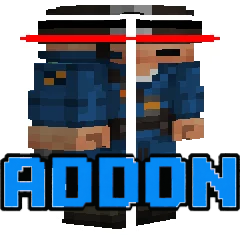
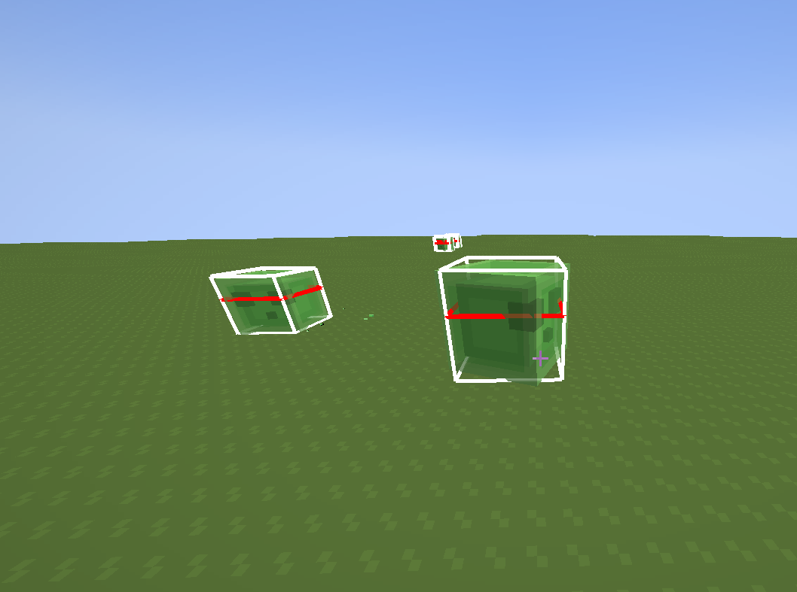
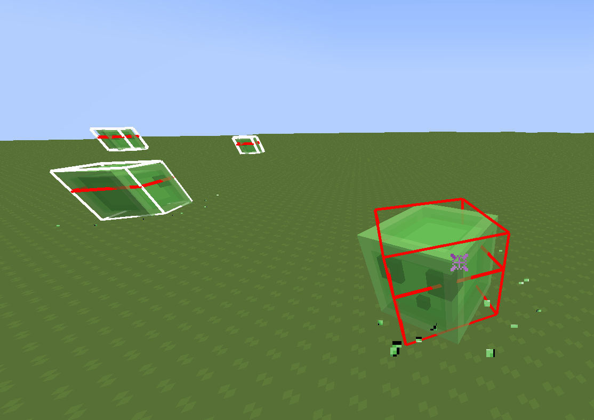
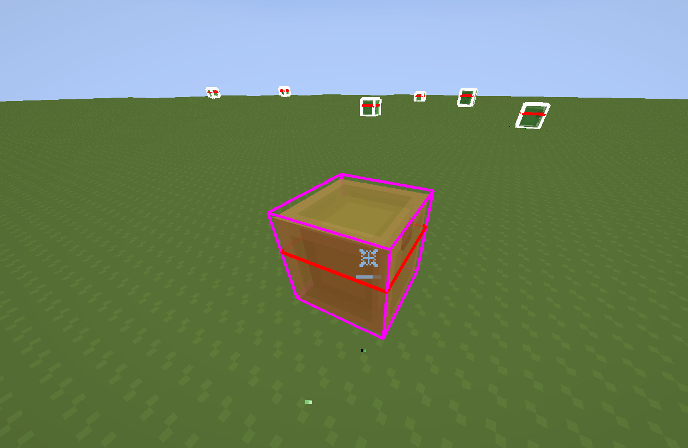
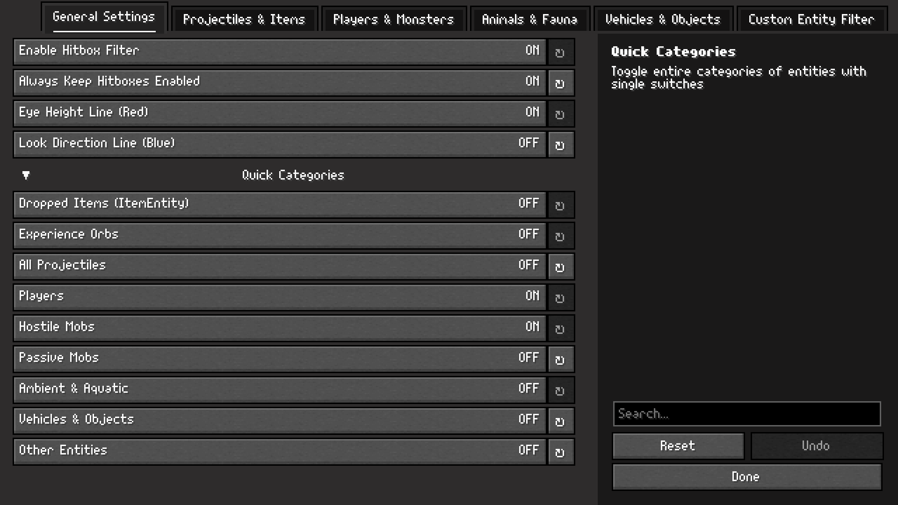

# Combat Hitbox Addon

  

| non tagret | target hitbox |
| :---: | :---: |
|  |  |
| **hit** | **settings** |
|  |  |

Fabric 1.21.1 client-side addon for [Combat Hitboxes](https://github.com/Sootysplash/Combat-Hitboxes) adding granular hitbox display filtering with a YetAnotherConfigLib (YACL) configuration interface.

---

## Features

### 1. Granular Hitbox Filtering
* **Dropped Items & Experience:** Independent toggles for dropped items (`ItemEntity`) and experience orbs (`ExperienceOrbEntity`) to remove visual clutter.
* **Projectiles:** Master toggle and per-entity filters for arrows, spectral arrows, tridents, ender pearls, snowballs, eggs, potions, fireballs, wither skulls, shulker bullets, wind charges, and fishing bobbers.
* **Players:** Separate options for multiplayer opponents/allies and third-person view (F5) self-hitbox.
* **Hostile Mobs:** Common monsters (Zombies, Skeletons, Creepers, Spiders, Endermen, Piglins, Slimes, Phantoms, Silverfish, Endermites, Vexes), Nether mobs (Blazes, Ghasts, Hoglins, Zoglins), Illagers, Trial Chamber Breezes, ocean Guardians, Shulkers, and bosses (Ender Dragon, Wither, Warden, Elder Guardian).
* **Passive & Ambient:** Livestock, pets, villagers, golems, bats, squids, and aquatic creatures.
* **Vehicles & Objects:** End crystals (crystal PvP), primed TNT, boats, minecarts, armor stands, item frames, paintings, falling blocks, and display entities.
* **Custom Registry Filter:** Blacklist or whitelist arbitrary entity IDs by registry path (e.g. `minecraft:bat` or modded IDs).

### 2. Interface & Compatibility
* **YetAnotherConfigLib (YACL v3):** Sodium and Reese's Sodium Options compatible user interface layout with vertical tabs, search bar, and tooltips.
* **Mod Menu:** Full configuration screen factory integration.
* **In-Game Hotkeys:** Keybindings for opening the settings screen and toggling filters on the fly.
* **Localization:** English (`en_us`) and Russian (`ru_ru`) language support.

---

## Controls

* **Open Filter Menu:** `H` (configurable in Options -> Controls -> Key Binds)
* **Toggle Hitbox Filter:** Unbound by default
* **Toggle Hitboxes (F3+B):** Unbound by default

---

## Requirements

* Minecraft `1.21.1`
* [Fabric Loader](https://fabricmc.net/) `>=0.15.0`
* [Fabric API](https://modrinth.com/mod/fabric-api)
* [YetAnotherConfigLib](https://modrinth.com/mod/yacl) `v3`
* [Combat Hitboxes](https://modrinth.com/mod/combat-hitboxes) (optional, fully compatible)

---

## Installation

1. Install Fabric Loader, Fabric API, and YetAnotherConfigLib v3.
2. Download `combat_hitbox_addon.jar` from [Releases](https://github.com/0xEtherPunk/combat-hitbox-addon/releases).
3. Place `.jar` into `.minecraft/mods/`.

---

## License

[MIT License](LICENSE) — Copyright (c) 2026 **0xEtherPunk**.
